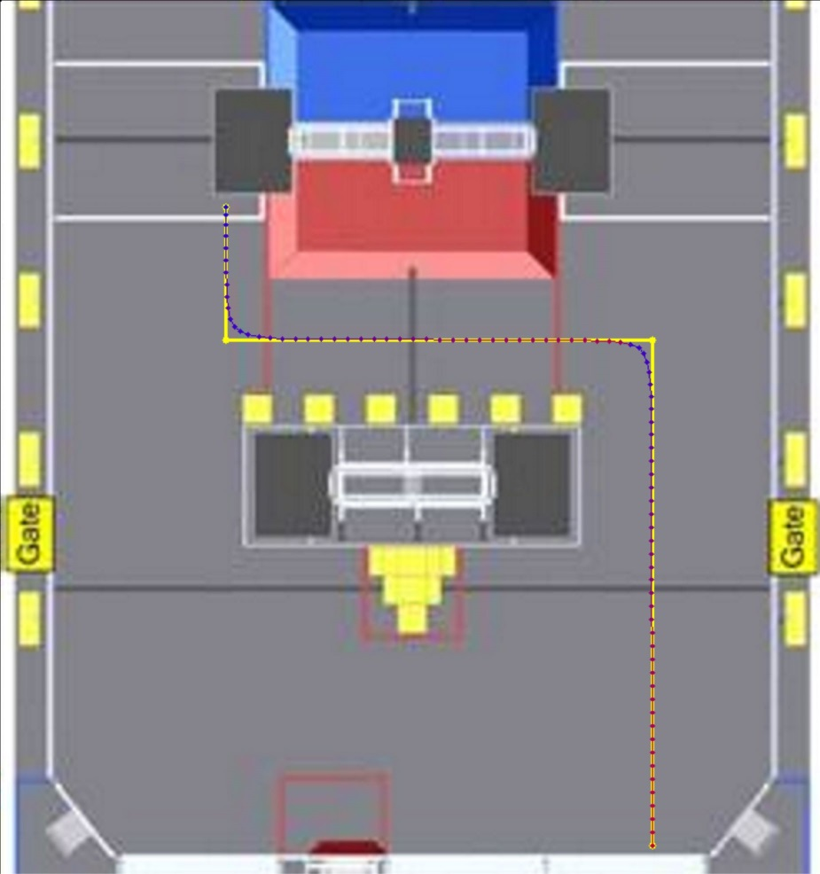
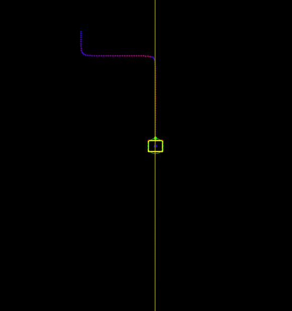

# PurePursuit
A python implementation of Team 1712's [Pure Pursuit Algorithm](https://www.chiefdelphi.com/media/papers/3488). The code is all custom, but the important equations and ideas come directly from the white paper.

## How It Works
The program is divided into two Python files, the [Path Generator](PathGenerator.py) and the [Robot Simulator](RobotSimulator.py), and the [config file](config.ini) to change constants.

__Path Generator__

The path generator works by loading and displaying an image of the field (set by the FIELD_LOCATION constant). The user can click on the image to set the desired waypoints. Hold shift when clicking to force the path vertical/horizontal. When all the waypoints have been selected, press endter and the program will smooth the path, generate velocity setpoints for each point, and save the data to the file specified by the FILE_LOCATION constant. 

__Robot Simulator__

The robot simulator shows how the robot will follow the path specified, only knowing its current location, angle, and the path waypoints and velocities. At each timestep, the robot finds the proper lookahead point, calculates the curvature and velocity needed to get to that point, and then sets the wheel speeds to follow that curvature and velocity. The simulator then recalculates the robot's new position and angle based on standard tank drive kinematics. All of this code could theoretically be used on a real robot, replacing the kinematic simulator with control loops to set the speeds of the wheels to the desired values. 

## The Config File
__FIELD_IMAGE__
* FILE_LOCATION: the relative or absolute location of the field image
* PIXELS_PER_UNIT: the scaling factor of the image to a real FRC field (i.e. how many pixels correspond to one unit on the real field - what unit is used does not matter, as long as it remains consistent throughout the program)

__POINT_INJECTION__
* POINT_DIST: How far apart the path's injected points should on a straight segment of the path (in distance units)
* WEIGHT_DATA: Constant used for path smoothing
* WEIGHT_SMOOTH: Constant used for path smoothing
* TOLERANCE: Constant used for path smoothing

__VELOCITY__
* MAX_VEL: The fastest the robot is allowed to go, according to the path velocity setpoints (in distance/sec)
* TURNING_CONST: Constant governing how much the robot slows down when turning
* STARTING_VEL: Velocity setpoint at the beginning of the path (in distance/sec)
* MAX_ACCEL: Acceleration limit on the path velocity setpoints (in distance/sec^2)

__PATH__
* FILE_LOCATION: Location where the Path Generator saves the path data, and the location where the Robot Simulator looks for said data
* LOOKAHEAD: The lookahead distance (in distance units)

__ROBOT__
* TRACKWIDTH: The distance between the robot's wheels - used for kinematic calculations and for the simulated robot's width (in distance units)
* LENGTH: The robot's length front-to-back - used only for drawing the simulated robot (in distance units)
* MAX_VEL_CHANGE: The fastest each wheel is allowed to change its velocity in the simulation, to represent the robot's inertia (in distance/sec)
